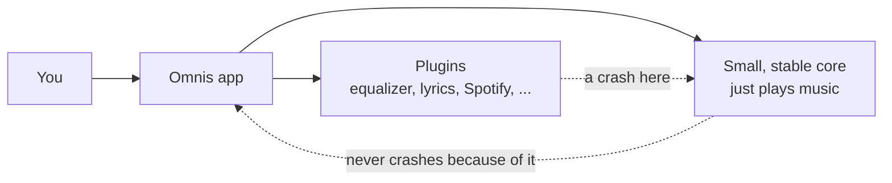

# Omnis

[](https://github.com/MrIvoe/Omnis/actions/workflows/ci.yml)
[](LICENSE)
[](https://mrivoe.github.io/Omnis/)
[](https://github.com/MrIvoe/Omnis/wiki)

## What is Omnis?

A music player. The part that plays your music is small and never
crashes; everything else — the equalizer, lyrics, Spotify/YouTube,
smart playlists, tag editing, and more — is a plugin you can add,
remove, or replace.

## Who it's for

Anyone who wants a music player that stays reliable no matter how many
features they pile on, and who'd rather pick their own features than
be stuck with everyone else's.

## Why built this way

A normal app can crash because of any feature in it. Omnis splits
"always works" (playback) from "everything else" (plugins), so a
broken or misbehaving feature can never take the music down with it —
and because features are plugins, you only run the ones you actually
want.

## How it works



Some plugins ship inside the app already; others you install yourself,
picking only what you want, from the
[Omnis-Plugins](https://github.com/MrIvoe/Omnis-Plugins) catalog.

## Where things live

```text
lib/       the app: a small core, plus the UI
packages/  contracts every plugin is built against
example/   a complete example plugin to copy from
docs/      technical documentation — start here to go deeper
test/      automated tests
```

## Download

[](https://github.com/MrIvoe/Omnis/releases/latest)

Beta builds for Android and Windows are published on the
**[Releases page](https://github.com/MrIvoe/Omnis/releases)**. iOS,
macOS, Linux, and Web aren't built yet — see
[docs/RELEASING.md](docs/RELEASING.md) for why and what's planned.

## Quick start

```bash
git clone <this-repo-url>
cd Omnis
flutter pub get
flutter run
```

See [docs/BUILDING.md](docs/BUILDING.md) for platform prerequisites and
building release artifacts.

## Want more detail?

Full feature list, architecture, how to build a plugin, and everything
else technical: **[docs/README.md](docs/README.md)**.

## Contributing

See [CONTRIBUTING.md](CONTRIBUTING.md). Short version: `flutter analyze`
and `flutter test` clean before every PR, new features come with tests,
and most contributions are plugins — see
[docs/PLUGIN_GUIDE.md](docs/PLUGIN_GUIDE.md).

## License

[MIT](LICENSE).
